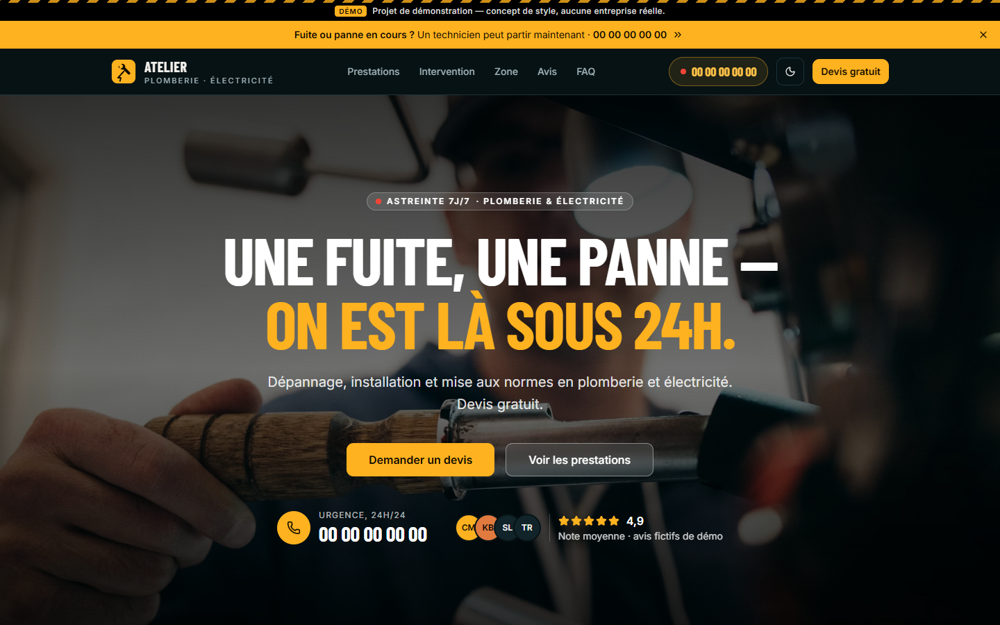
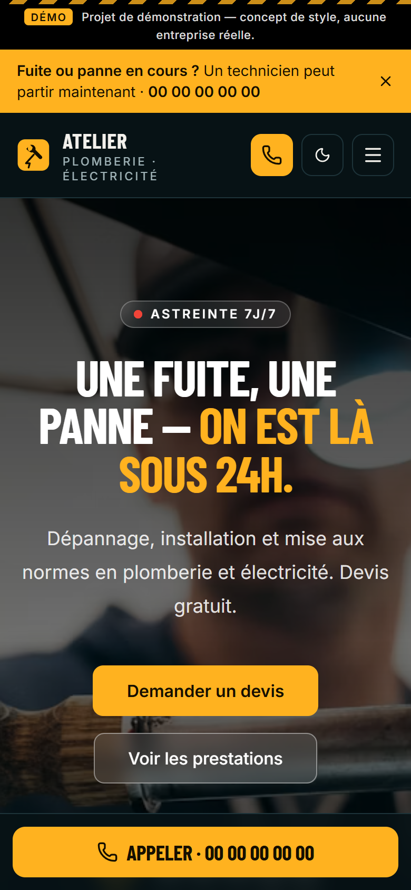

# Atelier Plomberie-Électricité — concept de site vitrine

> **Projet de démonstration.** Concept de style pour un artisan plombier-électricien.
> Aucune entreprise réelle : coordonnées, avis et formulaires sont fictifs.

**Démo en ligne : https://yboukamir.github.io/atelier-plomberie-electricite/**



<p align="center">
  
</p>

Vite + React + TypeScript + Tailwind CSS v4 + shadcn/ui + motion.

## Lancer

```bash
npm install
npm run dev
```

## Direction : « urgence »

Un site d'artisan dépanneur doit faire appeler. Tout est donc orienté vers le
numéro d'urgence et le devis :

- bandeau d'urgence refermable, numéro dans le header, bouton d'appel fixe en bas
  d'écran sur mobile ;
- vraies photos d'intervention en plein écran ;
- preuves de confiance : chiffre vedette (24h), note moyenne, mur d'avis,
  garantie décennale ;
- étapes d'intervention, zone et délais, FAQ, puis un dernier appel à l'action.

### Palette

Sombre par défaut, avec un thème clair accessible via le bouton soleil/lune.

| Rôle | Sombre | Clair | Usage |
| --- | --- | --- | --- |
| `background` | pétrole presque noir `#071215` | `#f6f4ef` | fond |
| `primary` | ambre électrique `#ffb21f` | `#f5a300` | boutons, pastilles (texte foncé dessus) |
| `highlight` | `#ffc247` | `#9a5800` | ambre utilisable en texte (surtitres, icônes) |
| `accent` | cuivre `#e07a3f` | `#b5541f` | appoint |

Tokens dans [`src/index.css`](src/index.css), exposés à Tailwind via `@theme inline`.
Typographie : Barlow Condensed (titres, capitales) + Inter (texte), auto-hébergées
via [Fontsource](https://fontsource.org/) en sous-ensemble latin (accents compris).

### Thème clair / sombre

- Sombre au premier chargement ; le choix explicite est mémorisé dans
  `localStorage` (clé `atelier-theme`).
- Un script inline dans [`index.html`](index.html) applique la classe `dark` avant
  le premier rendu : pas de flash. Il partage la clé avec
  [`src/lib/theme-context.ts`](src/lib/theme-context.ts) — changer l'une, c'est
  changer l'autre.
- Les deux thèmes passent un audit de contraste WCAG AA sur l'ensemble des textes.

## Sections et composants 21st.dev

Chaque section part d'un composant 21st.dev, choisi sur aperçu parmi plusieurs
candidats, puis adapté (textes en français, palette, `motion/react` au lieu de
`framer-motion`, `<a>` au lieu de `next/link`, utilitaires manquants réécrits).

| Section | Fichier | Composant d'origine |
| --- | --- | --- |
| Bandeau d'urgence | [`sections/site-header.tsx`](src/components/sections/site-header.tsx) | `shadcndesign/banner-1` |
| Hero | [`sections/hero.tsx`](src/components/sections/hero.tsx) | `ravikatiyar162/hero-section-4` |
| Note ★ du hero | [`ui/rating-badge.tsx`](src/components/ui/rating-badge.tsx) | `prebuiltui/testimonial` (démo avatars) |
| Chiffres clés | [`sections/chiffres.tsx`](src/components/sections/chiffres.tsx) | `uilayout.contact/stats-bold` |
| Prestations | [`sections/prestations.tsx`](src/components/sections/prestations.tsx) | `lavikatiyar/feature-grid` |
| Intervention | [`sections/etapes.tsx`](src/components/sections/etapes.tsx) | `ravikatiyar162/how-it-works` |
| Zone | [`sections/zone-intervention.tsx`](src/components/sections/zone-intervention.tsx) | `Mazyar kawa/location-map` |
| Avis | [`sections/avis.tsx`](src/components/sections/avis.tsx) | `efferd/testimonials-section` |
| Appel final | [`sections/appel-final.tsx`](src/components/sections/appel-final.tsx) | `ziegfiroyt/cta69` |
| FAQ | [`sections/faq.tsx`](src/components/sections/faq.tsx) | `shadcnblockscom/faq3` |
| Devis | [`sections/devis.tsx`](src/components/sections/devis.tsx) | `efferd/contact-card` |
| Footer | [`sections/site-footer.tsx`](src/components/sections/site-footer.tsx) | `solaceui/footer-section-3` |

Le header (logo, navigation, numéro) est sur mesure.

Les avis sont illustrés par des **initiales**, pas par des photos : ils sont
fictifs, on ne leur prête pas de vrais visages.

## Performance et accessibilité

Audit Lighthouse, puis corrections :

- **Polices auto-hébergées** : plus de requête bloquante vers Google Fonts.
- **Photos responsives** : `srcset` + `sizes` sur toutes les images ; le navigateur
  télécharge la largeur utile (960 px pour le hero sur mobile, pas 2000).
- **Photo du hero** en ``, préchargée dans
  [`index.html`](index.html) avec le même `srcset` — les largeurs doivent rester
  identiques à celles de [`sections/hero.tsx`](src/components/sections/hero.tsx).
- **Accessibilité** : notes en étoiles exposées avec `role="img"`, niveaux de
  titres sans saut, liens tous nommés.

Le score SEO reste volontairement bas : la page porte `noindex` (voir plus bas).

## Aperçu de partage

Balises Open Graph dans [`index.html`](index.html), image
[`public/og-image.png`](public/og-image.png) (1200 × 630). Les URL y sont
absolues : à mettre à jour si le dépôt change de nom.

Les captures (aperçu de partage et README) sont faites avec puppeteer-core en
émulant « animations réduites », pour figer les composants dans leur état final.

## Photos

Toutes sous [licence Unsplash](https://unsplash.com/license) (gratuite, usage
commercial autorisé, crédit non obligatoire mais donné ici). Les photos
Unsplash+ (payantes) ont été écartées. Elles sont servies par le CDN d'Unsplash
(`images.unsplash.com`), rien n'est stocké dans le dépôt.

| Usage | Photo | Auteur |
| --- | --- | --- |
| Hero | [Plombier au chalumeau](https://unsplash.com/photos/NfG4rXmceFM) | Battlecreek Coffee Roasters |
| Chiffres clés | [Eau jaillissant d'un tuyau](https://unsplash.com/photos/91LGCVN5SAI) | Daan Mooij |
| Dépannage fuite | [Canalisations sous évier](https://unsplash.com/photos/wzIjLL4KB-4) | Timur Shakerzianov |
| Mise aux normes | [Électricien au tableau](https://unsplash.com/photos/_2AlIm-F6pw) | Emmanuel Ikwuegbu |
| Chauffe-eau | [Raccord de chauffe-eau](https://unsplash.com/photos/C-oYJoIfgCs) | Marian Florinel Condruz |

## Déploiement

Chaque push sur `main` déclenche [`.github/workflows/deploy.yml`](.github/workflows/deploy.yml) :
`npm ci`, puis `npm run build` (typecheck inclus), puis publication sur GitHub Pages.
Le workflow peut aussi être relancé à la main depuis l'onglet Actions.

Le site est servi sous `/<nom-du-depot>/` : le workflow passe ce chemin à Vite via
la variable `BASE_PATH` (voir [`vite.config.ts`](vite.config.ts)). En local, sans
variable, la base reste `/`.

## Limites assumées

- Le formulaire de devis n'envoie rien : il affiche un message de démonstration.
- Numéro, e-mail et avis sont des valeurs de remplissage.
- `<meta name="robots" content="noindex">` est posé pour que la démo ne soit pas
  prise pour une vraie entreprise dans les moteurs de recherche.
